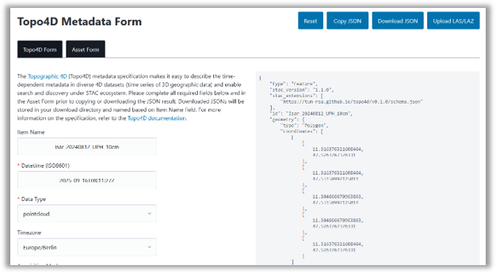

# Topo4D Form

Interactive FastHTML app to build a STAC Item with the [topo4d](https://github.com/tum-rsa/topo4d) extension using the local schema.json. It live-validates and lets you copy/download the JSON.

## Build

Run locally:

1. `pip install -r requirements.txt`
2. `python main.py`

Notes:
- The form writes topo4d extension properties (e.g., `topo4d:data_type`) and uses the extension URL from [topo4d](https://github.com/tum-rsa/topo4d).
- To apply the latest extension, update the extension URL at [`__init__.py`](./topo4d_form/__init__.py).
- Validation uses the bundled `schema.json` via `jsonschema`.

## Acknowledgement

This form is inspired and forked from the Machine Learning Model Metadata Form ([mlm-form](https://github.com/wherobots/mlm-form)).